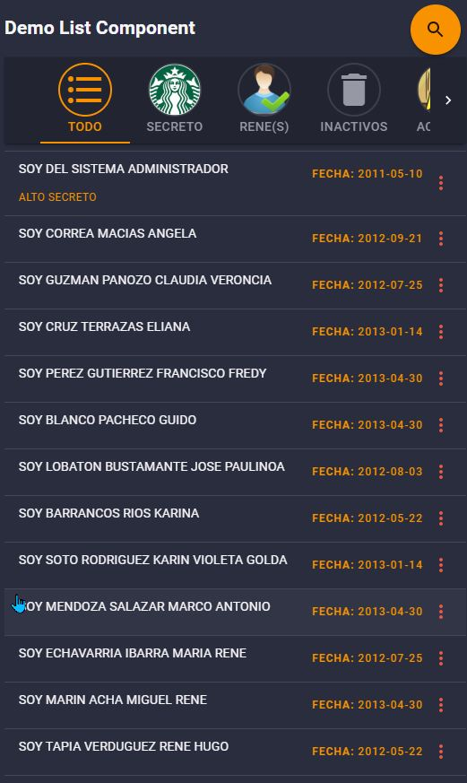

# ListPxp React 
This is a component that allows you to view data in a custom list.

***Documentation constantly updated.***

### Usage
Import the component in the place you want to use, the component path is `./src/_pxp/components/ListPxp/ListPxpData`, example:
```jsx
    import ListPxpData from '../../_pxp/components/ListPxp/ListPxpData';
```

Define a configuration variable:
```jsx
    const config = {
      columns:{
        primary: {
          field: 'fieldHeader',
        },
        secondary: {
          field: 'fieldSecondary',
        },
        terciary: {
          field: 'fieldTerciary',
        },
        detail: [
            field: 'fieldDeatil1',
            text: 'Field Text 1'
        ]
      }
    };
```

Define the `config` variable as props in the `ListPxpData` component:
```jsx
    <ListPxpData config={config}/>
```
<!--  -->
### Demo
[](image.jpg)
### Props
The following props are accepted:
#### config
Component configuration object

#### Config Options
Options property could be given to component as `config` property. You can change behaviour of list.

| Field                      | Type                   | Default       | Description                                                                       |
|:---------------------------|:-----------------------|:--------------|:----------------------------------------------------------------------------------|
| showActions           | boolean                 | true              | Flag to show or hide actions                      |
| showDetail          | boolean                 | true              | Flag to show or hide panel of details               |
| showSearch         | boolean                 | false              | Flag to show float search button             |
| showFilter         | boolean                 | true              | Flag to show filters panel             |
| columns             | object      |          | It needs to have the `primary`, `secondary` and `tertiary` and `detail` properties, or the `render` and `detailRender` properties for it to work.   |


This prop previously was called "option", but has since been renamed.
If you provide "option" as a prop, it will be used unless "options" is also passed.


### Example
A working example can be found in the example directory `./src/_pxp/components/ExampleList.js`. 

